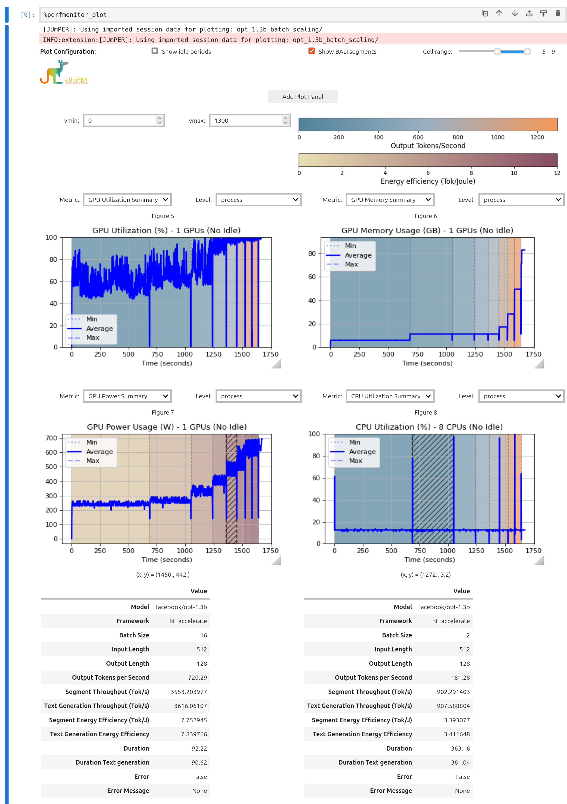

 

# BALI - Benchmark for Accelerated Language Model Inference
<p align="center">
  <strong>An open-source benchmarking framework for evaluating and comparing accelerated LLM inference Frameworks.</strong>
</p>
<p align="center">
  <a href="#supported-frameworks">Supported Frameworks</a> •
  <a href="#installation">Installation</a> •
  <a href="#usage">Usage</a> •
  <a href="#configuration">Configuration</a> •
  <a href="#jumplm">JumpLM</a> •
  <a href="#citation">Citation</a>
</p>
<p align="center">
  
</p>

---

## Overview

**BALI** is a flexible and extensible benchmarking suite for evaluating the performance of Large Language Model (LLM) inference frameworks.

It enables:

- Fine-grained LLM inference configuration
- Comparative evaluation across inference backends
- GPU-aware performance measurements
- Integration with interactive Jupyter workflows

BALI is designed for researchers and practitioners who want reproducible and configurable LLM inference benchmarking tailored to specific workloads and deployment scenarios.

---
## Supported Frameworks

| Framework | Description |
|---|---|
| [vLLM](https://docs.vllm.ai/en/latest/) | High-throughput and memory-efficient LLM serving |
| [Hugging Face Transformers](https://huggingface.co/docs/transformers/index) | Baseline inference implementation |
| [LLMLingua](https://github.com/microsoft/LLMLingua/tree/main) | Prompt compression for efficient inference |
| [OpenLLM](https://github.com/bentoml/OpenLLM) | Open-source LLM serving platform |
| [DeepSpeed-MII](https://github.com/microsoft/DeepSpeed-MII) | Optimized inference for large-scale transformer models |

---

## Installation

### Environment Setup

```bash
source setup_cuda126_torch260.sh
source env_cuda126_torch260.sh
```

---

## Usage

### Run Benchmark Using a JSON Configuration

```bash
source pyenv_inferbench/bin/activate

python inferbench.py \
  --config-file configs/template.json
```

### Run Benchmark from the Command Line

```bash
python inferbench.py \
  --model-name gpt2 \
  --data data/prompts.txt \
  --batch-size 1 \
  --input-len 100 \
  --output-len 100
```

> [!NOTE]
> Configuration values provided via the command line override values defined in the JSON configuration file.


### Automated SLURM Benchmark Execution

For large-scale experiments, BALI provides the helper script:

```bash
benchmark_jobs_spawner.sh
```

The script automatically launches benchmark sweeps across:

- Multiple models
- Input sequence lengths
- Output sequence lengths
- Framework configurations

using `template.json` as the base configuration.

---

## Configuration

### Core Parameters

| Parameter | Description |
|---|---|
| `--model-name` | LLM used for benchmarking |
| `--tokenizer` | Tokenizer to use (defaults to model tokenizer) |
| `--frameworks` | List of inference frameworks to benchmark |
| `--data` | Path to prompt dataset |
| `--output-dir` | Directory for benchmark results |
| `--config-file` | JSON configuration file |
| `--save-slurm-config` | Save SLURM environment variables |
| `--gpu_sampling` | Record GPU metrics using ['nvml'] |
| `--loglevel` | Logging level (`info`, `debug`, etc.) |
| `--input-len` | Input sequence length |
| `--output-len` | Generated output sequence length |
| `--dtype` | Inference precision / datatype |
| `--warm-up-reps` | Number of warm-up iterations |
| `--repeats` | Number of benchmark repetitions |
| `--num-gpus` | Number of GPUs used |
| `--batch-size` | Prompt batch size |
| `--generate-from-token` | Benchmark from token IDs with fixed input length |
| `--num-samples` | Number of prompts sampled |
| `--tokenizer-init-config` | Tokenizer initialization configuration |
| `--tokenize-config` | Tokenization configuration |
| `--compression-config` | LLMLingua compression configuration |
---

# JumpLM

JumpLM combines:

- [JUmPER](https://github.com/ScaDS/jumper_ipython_extension/tree/bali-hook#)
- BALI

for integrated LLM benchmarking and hardware performance monitoring directly inside Jupyter notebooks.

<p align="center">
  
</p>

---

## JumpLM Setup

### 1. Install BALI

Follow the installation instructions above.

### 2. Install JUmPER

```bash
git clone git@github.com:ScaDS/jumper_ipython_extension.git
cd jumper_ipython_extension

git switch bali-hook
pip install .
```

### 3. Install Notebook Dependencies

```bash
pip install ipywidgets ipympl ipykernel pynvml
```

### 4. Register Jupyter Kernel (Optional)

```bash
python -m ipykernel install \
  --prefix $BALI_REPO/BALI/pyenv_inferbench_cuda126_torch260 \
  --display-name jumpLM-kernel
```

---
## JumpLM Usage in Jupyter
JumpLM is available through a variety of cell magics.

### Load Extensions and Start Performance Monitoring

```python
%reload_ext jumper_extension
%reload_ext bali
%perfmonitor_start --monitor thread_bali
```

### Configure Benchmark

```yaml
%%bali_config
model_name: facebook/opt-1.3b
frameworks: hf_accelerate
batch_size: 128
input_len: 32
output_len: 32
warm_up_reps: 0
repeats: 1
```

### Available Commands

| Command | Description |
|---|---|
| `%bali_config_show` | Display current BALI configuration |
| `%bali_run` | Execute benchmark |
| `%bali_plot` | Generate inference speed heatmaps |
| `%perfmonitor_plot` | Show hardware performance visualization |

---

## Citation

If you use BALI in your research, please cite:

```bibtex
@ARTICLE{jurkschat2025bali,
  author={Jurkschat, Lena and Gattogi, Preetam and Vahdati, Sahar and Lehmann, Jens},
  journal={IEEE Access},
  title={BALI—A Benchmark for Accelerated Language Model Inference},
  year={2025},
  volume={13},
  pages={98976-98989},
  doi={10.1109/ACCESS.2025.3576898}
}
```

