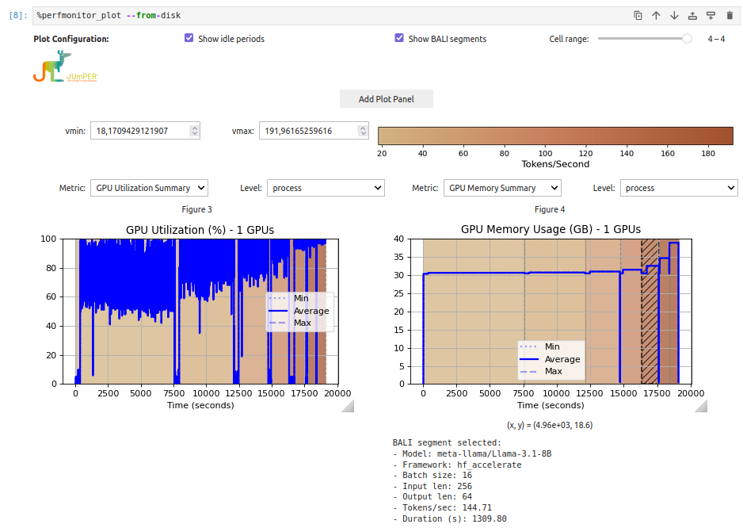

 

# BALI - Benchmark for Accelerated <br> Language Model Inference

BALI is an Open-source Benchmark to compare LLM Inference Frameworks.
It allows a gine grained configuration of the inference, tailored to application needs.

## BALI Pipeline


## List of included Acceleration Frameworks
|Framework|Link|
|----|----|
|VLLM|https://docs.vllm.ai/en/latest/|
|Huggingface Transformers (baseline)|https://huggingface.co/docs/transformers/index|
|LLMLingua|https://github.com/microsoft/LLMLingua/tree/main|
|OpenLLM|https://github.com/bentoml/OpenLLM|
|DeepSpeed|https://github.com/microsoft/DeepSpeed-MII|


## Installation
```bash
source setup_cuda121_torch212.sh
source env_cuda121_torch212.sh
```


## Usage
BALI can be used via a JSON config file, defining the intented parameters:
```bash
source pyenv_inferbench/bin/activate
python inferbench.py --config-file 'configs/template.json'
```
Additionally, all parameters are available via the command line interface:
```bash
python inferbench.py --model-name 'gpt2' --data  'data/prompts.txt' --batch-size 1 --input_len 100 --output-len 100 
```
Note, that the config is read and overwritten by the command line arguments.

For Convenience, you might use `benchmark_jobs_spawner.sh` that will launch a wave of Slurm jobs, one for each model x input_size x output_size configuration, using `template.json` as base for configuration.

### Parameters
```
  --model-name                  LLM to use for Benchmark run
  --tokenizer                   Tokenizer to use, default is same as model
  --frameworks                  List of Inference accelerations frameworks to measure performance
  --data                        Path to the prompts text file
  --output-dir                  Results directory
  --config_file                 Config file for running the benchmark.
  --save-slurm-config           Save SLURM environment variables
  --loglevel                    Provide logging level, default is info. Use debug for detailed log
  --input-len                   Sequence len per sample
  --output-len                  Sequence length to generate per prompt
  --dtype                       Inference data type
  --warm-up-reps                Warm up repetitions of benchmark per framework
  --repeats                     Repetitions of inference benchmark per framework
  --num-gpus                    Number of GPUs to use for benchmark
  --batch-size                  Batch Size for prompts
  --generate-from-token         BALI setting, measures inference speed from token ids with fixed input length
  --num-samples                 Amount of Prompts to sample from data
  --tokenizer-init-config       Config Dictionary to initialize the tokenizer
  --tokenize-config             Config Dictionary for tokenize function parameters
  --compression-config          Prompt Compression Configuration for LLMLingua
```
## JumpLM - Benchmarking LLMs in Jupyter

JumpLM is combined Tool from [JUmPER](https://github.com/ScaDS/jumper_ipython_extension/tree/bali-hook#) and BALI
for joint LLM benchmarking and hardware performance monitoring.

### Setup
1. Install BALI, see [Installation](#installation)
2. Install [JUmPER](https://github.com/ScaDS/jumper_ipython_extension/tree/bali-hook#) extension
```bash
git clone git@github.com:ScaDS/jumper_ipython_extension.git
cd jumper_ipython_extension 
git switch bali-hook
pip install .
```
3. Install dependencies
```bash
pip install ipywidgets ipympl iypkernel
```
4. If needed, build kernel from virtual env via
```bash
python -m ipykernel install --prefix $BALI_REPO/BALI/pyenv_inferbench_cuda126_torch260 --display-name jumpLM-kernel
```
5. Launch Notebook, the following command should be available using the kernel:

### Usage in Jupyter Notebook
JumpLM is available through a variety of cell magics.

1. Load Extensions and start performance monitor
```jupyter
%reload_ext jumper_extension
%reload_ext bali
%perfmonitor_start
```

2. Set your inference config
```jupyter
%%bali_config
model_name: facebook/opt-1.3b 
frameworks: hf_accelerate
batch_size: 128
input_len: 32
output_len: 32
warm_up_reps: 0
repeats: 1
```
3. Show BALI config via `%bali_config_show`
3. run BALI via `%bali_run`
4. Plot inference speed heatmaps via  `%bali_plot`
5. Start JUmPER Performance Visualization: `%perfmonitor_plot`


## Citation
```
@ARTICLE{jurkschat2025bali,
  author={Jurkschat, Lena and Gattogi, Preetam and Vahdati, Sahar and Lehmann, Jens},
  journal={IEEE Access}, 
  title={BALI—A Benchmark for Accelerated Language Model Inference}, 
  year={2025},
  volume={13},
  pages={98976-98989},
  doi={10.1109/ACCESS.2025.3576898}}
```
